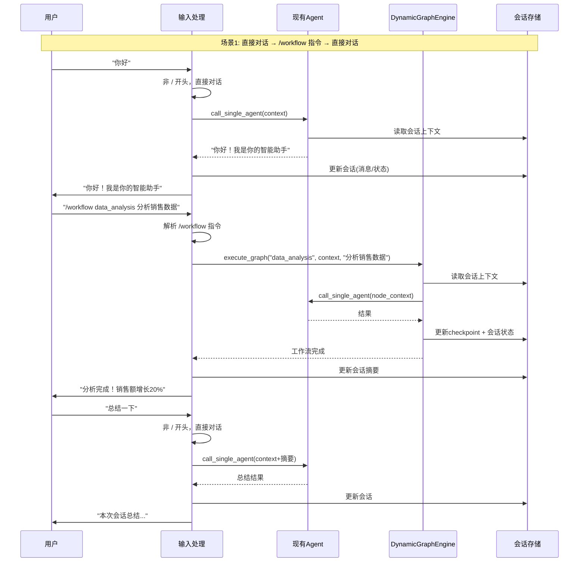
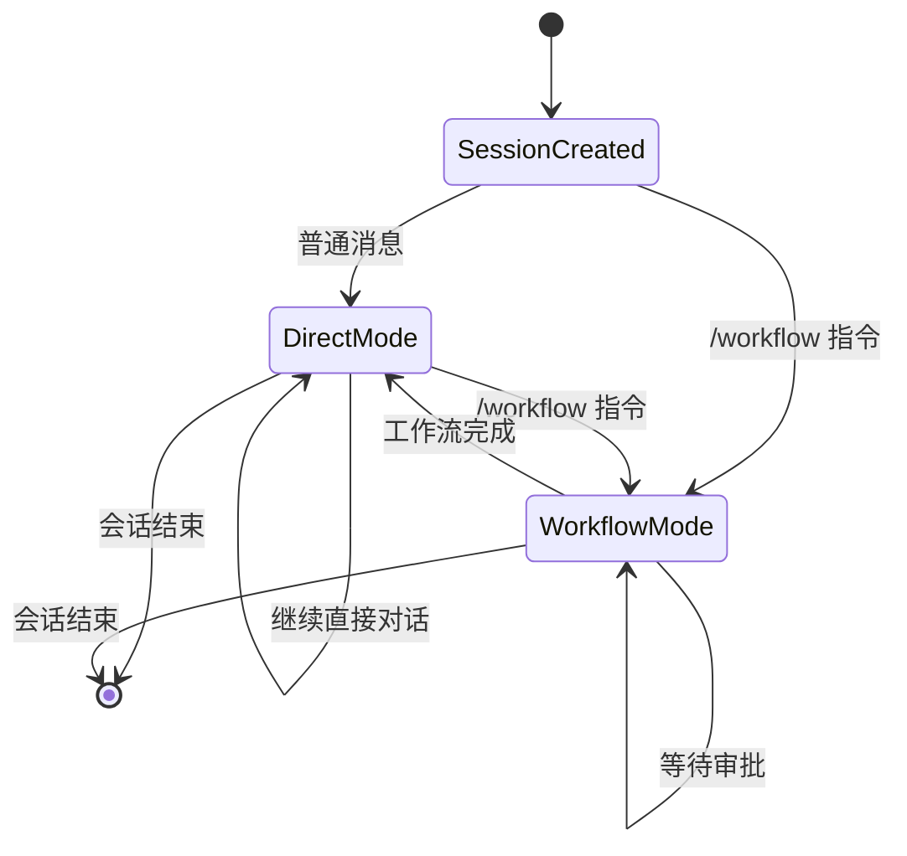
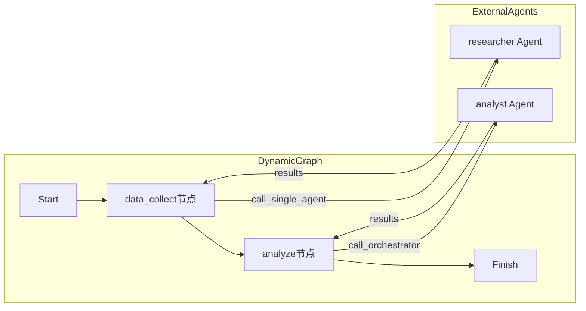
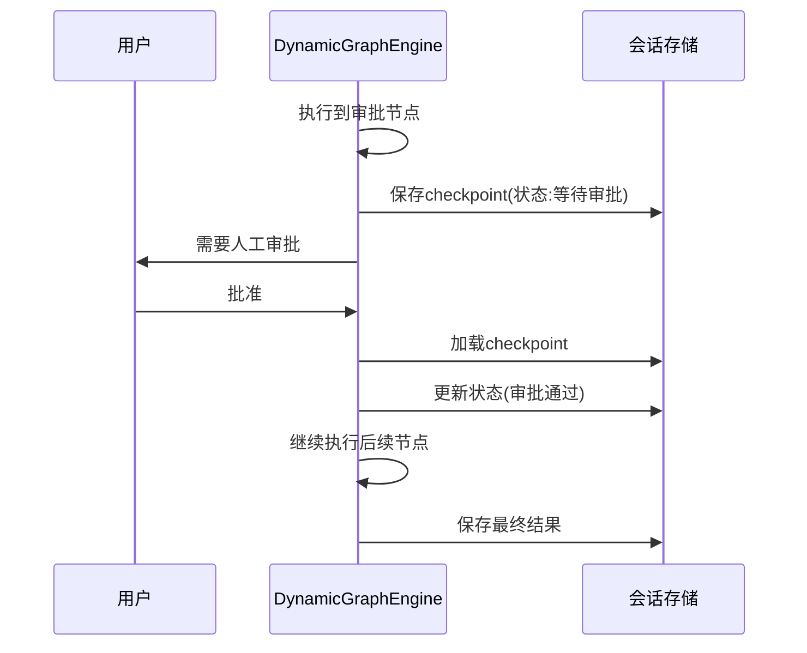

# Dynamic Graph 动态图实现方案

## 1. 需求分析

### 1.1 核心需求
基于用户需求和 LangGraph 官方文档，设计一个**可配置的动态图系统**，与现有 Agent 系统无缝集成并支持交替处理：

| 需求点 | 描述 | 来源 |
|--------|------|------|
| 动态图配置 | 用户通过前端页面配置 graph（生成 JSON/YAML） | 用户需求 |
| 消息传递 | 支持节点间灵活的消息传递机制 | LangGraph Overview |
| Checkpoint | 支持图执行状态的持久化和恢复 | LangGraph Checkpoint |
| Timeline | 可视化展示图执行的时间线 | 用户需求 |
| 审批流程 | 支持人工审批节点 | 用户需求 |
| **`/` 指令调度** | **通过 `/workflow <name>` 指令触发动态图执行** | 用户反馈 |
| **上下文共享** | **动态图与会话共享上下文，状态双向同步** | 用户反馈 |
| **交替处理** | **现有 Agent 与 Dynamic Graph 交替处理时上下文正确流转** | 用户反馈 |

---

## 2. 现有 Agent 与 Dynamic Graph 交替处理的上下文变化

### 2.1 交替处理场景概览



### 2.2 上下文状态流转图



---

## 3. 交替处理时的上下文变化细节

### 3.1 场景一：直接对话 → 工作流

| 阶段 | 上下文状态 | 说明 |
|------|------------|------|
| 初始状态 | `history=[user:"你好"]`, `summary=""`, `results={}` | 用户发送第一条消息 |
| 直接回复后 | `history=[user:"你好", assistant:"你好！..."]`, `summary=""`, `results={}` | Agent 回复，消息加入历史 |
| 输入 /workflow | `history=[...]`, `summary=""`, `results={}` | 解析指令，获取 graph_id 和参数 |
| 工作流执行中 | `history=[...]`, `summary=""`, `results={"step1": "..."}` | 节点执行，结果累积 |
| 工作流完成 | `history=[...assistant:"分析完成"]`, `summary="分析销售数据..."`, `results={}` | 结果写入历史，更新摘要 |

### 3.2 场景二：工作流内部调用 Agent



**上下文传递链：**
```
会话上下文 
    ↓ (继承 history/summary/project_path)
工作流初始状态 
    ↓ (注入 task/results)
节点上下文 
    ↓ (格式化 task_template)
Agent 调用参数
    ↓ (执行)
Agent 响应 
    ↑ (提取结果)
节点结果 
    ↑ (累积到 results)
工作流最终状态 
    ↑ (更新会话)
会话更新
```

### 3.3 场景三：工作流 → 审批 → 继续



---

## 4. 上下文数据结构变化

### 4.1 会话上下文结构（统一格式）

```json
{
  "session_id": "session-xxx",
  
  // 会话基础信息
  "history": [
    {"role": "user", "content": "你好"},
    {"role": "assistant", "content": "你好！我是你的智能助手"},
    {"role": "user", "content": "帮我分析销售数据"},
    {"role": "assistant", "content": "[数据采集] 正在收集...", "agent": "researcher"},
    {"role": "assistant", "content": "[总结] 分析完成！", "agent": "router"}
  ],
  
  "summary": "用户请求分析销售数据，已完成分析，销售额增长20%",
  
  // 工作流相关状态
  "current_graph_id": null,  // 当前执行的工作流(工作流执行时填充)
  "graph_state": {
    "task": "",
    "results": {},
    "current_node": null,
    "step_count": 0,
    "is_interrupted": false,
    "pending_approval": null
  },
  
  // 共享资源
  "project_path": "/workspace/project",
  "task_updates": [],
  "metrics": {"agent_calls": 5, "tokens": {...}},
  "audit_summary": "..."
}
```

### 4.2 交替处理时的状态变化

| 操作 | history | summary | current_graph_id | graph_state | project_path |
|------|---------|---------|-----------------|-------------|--------------|
| 初始 | `[]` | `""` | `null` | `{}` | `null` |
| 直接回复 | `+1 assistant` | `""` | `null` | `{}` | `null` |
| 启动工作流 | 不变 | 不变 | `workflow-001` | `{task, results:{}}` | `/workspace/xxx` |
| 节点执行 | `+1 agent message` | 不变 | `workflow-001` | `{results:{...}}` | 不变 |
| 审批暂停 | 不变 | 不变 | `workflow-001` | `{is_interrupted:true}` | 不变 |
| 审批通过 | `+1 approval message` | 不变 | `workflow-001` | `{is_interrupted:false}` | 不变 |
| 工作流完成 | `+1 summary message` | 更新 | `null` | `{}` | 不变 |
| 继续对话 | `+1 assistant` | 累积 | `null` | `{}` | 不变 |

---

## 5. 核心组件协作

### 5.1 CommandDispatcher 与 Agent 的协作

```python
class CommandDispatcher:
    """命令调度器 - 解析 / 指令并分发到对应处理器"""

    def __init__(self):
        self.commands = {
            "/compact": self._handle_compact,
            "/clear": self._handle_clear,
            "/new": self._handle_new,
            "/workflow": self._handle_workflow,  # 新增 workflow 指令
            "/wf": self._handle_workflow,         # 简写
        }

    async def dispatch(self, session_id: str, user_message: str):
        """分发用户消息"""
        # 1. 加载统一的会话上下文
        session_context = await ContextManager.load_session_context(session_id)

        # 2. 解析指令
        if user_message.startswith("/"):
            parts = user_message.split(maxsplit=2)
            cmd = parts[0].lower()
            args = parts[1] if len(parts) > 1 else None
            params = parts[2] if len(parts) > 2 else ""

            if cmd in self.commands:
                async for event in self.commands[cmd](session_id, args, params, session_context):
                    yield event
                    # 实时更新会话状态
                    await ContextManager.update_session(session_id, event)
                return

        # 3. 非 / 开头，直接对话模式
        async for event in self._direct_response(session_id, user_message, session_context):
            yield event
            await ContextManager.update_session(session_id, event)

    async def _handle_workflow(self, session_id: str, graph_id: str, params: str, context: dict):
        """处理 /workflow 指令"""
        if not graph_id:
            yield {"type": "error", "data": "请指定工作流 ID，例如: /workflow data_analysis"}
            return

        # 检查工作流是否存在
        graph_config = await GraphConfigManager.get_graph(graph_id)
        if not graph_config:
            yield {"type": "error", "data": f"工作流 '{graph_id}' 不存在"}
            return

        # 执行工作流
        engine = DynamicGraphEngine(graph_config)
        async for event in engine.execute(session_id, params, context):
            yield event
            # 更新会话状态 + checkpoint
            if event.get("type") == "node_complete":
                await CheckpointManager.save(session_id, event["state"])

    async def _direct_response(self, session_id: str, message: str, context: dict):
        """调用现有 Agent 直接回复"""
        agent = Agent(self.config)
        async for event in agent.run(
            message,
            history=context["history"],
            summary=context["summary"]
        ):
            yield event
```

### 5.2 DynamicGraphEngine 与 Agent 的协作

```python
class DynamicGraphEngine:
    """动态图引擎 - 调用现有 Agent 作为节点执行器"""
    
    async def _execute_node(self, node: NodeConfig, state: dict) -> dict:
        """执行单个节点"""
        node_type = node.get("type")
        
        if node_type == "agent":
            # 调用现有 Agent/Orchestrator
            agent_type = node["config"].get("agent_type", "single")
            
            if agent_type == "single":
                # 调用单 Agent（复用现有实现）
                agent = self._get_agent(node["config"]["agent_id"])
                result = await agent.run(
                    task=self._build_task(node, state),
                    history=state.get("history", []),
                    summary=state.get("summary", "")
                )
                
            elif agent_type == "multi":
                # 调用 Orchestrator（复用现有实现）
                orchestrator = Orchestrator(self.config)
                result = await orchestrator.run(
                    task=self._build_task(node, state),
                    history=state.get("history", []),
                    summary=state.get("summary", "")
                )
            
            # 将结果合并到图状态
            state["results"][node["id"]] = result
            return state
            
        elif node_type == "approval":
            # 暂停执行，等待审批
            state["is_interrupted"] = True
            state["pending_approval"] = {"node_id": node["id"]}
            await CheckpointManager.save(state["session_id"], state)
            return state
```

---

## 6. 交替处理的关键设计

### 6.1 统一上下文入口

所有执行路径都通过 `ContextManager` 获取和更新上下文：

```python
class ContextManager:
    """统一上下文管理器"""
    
    @staticmethod
    async def get_session_context(session_id: str) -> dict:
        """获取完整的会话上下文"""
        # 从数据库加载
        session = await get_session(session_id)
        history = await load_history_with_meta(session_id)
        
        # 尝试加载未完成的工作流状态
        checkpoint = await CheckpointManager.get_latest(session_id)
        
        return {
            "session_id": session_id,
            "history": history,
            "summary": session.get("summary", ""),
            "project_path": session.get("project_path", ""),
            "current_graph_id": checkpoint.get("graph_id") if checkpoint else None,
            "graph_state": checkpoint.get("state") if checkpoint else {},
            "task_updates": session.get("task_updates", []),
            "metrics": session.get("metrics", {}),
            "audit_summary": session.get("audit_summary", "")
        }
    
    @staticmethod
    async def update_session_context(session_id: str, updates: dict):
        """更新会话上下文"""
        # 更新会话表
        await update_session(session_id, updates)
        
        # 如果是工作流执行，同时更新 checkpoint
        if updates.get("graph_state"):
            await CheckpointManager.save(session_id, updates["graph_state"])
```

### 6.2 上下文继承与隔离

```python
# 上下文继承策略配置
context_policy = {
    # 从会话继承到工作流
    "inherit_from_session": {
        "history": True,      # 继承消息历史
        "summary": True,      # 继承会话摘要
        "project_path": True, # 继承工作目录
        "metrics": False      # 不继承指标（工作流独立计算）
    },
    
    # 从工作流写回到会话
    "write_back_to_session": {
        "history": True,          # 添加工作流消息到历史
        "summary": True,          # 更新会话摘要
        "task_updates": True,     # 记录任务更新
        "metrics": True,          # 合并执行指标
        "graph_state": False      # 不写入图状态（checkpoint单独存储）
    },
    
    # 工作流内部隔离
    "isolate_graph": {
        "results": True,          # 工作流结果只在图内可见
        "step_count": True,       # 步骤计数隔离
        "current_node": True      # 当前节点隔离
    }
}
```

---

## 7. 使用示例（交替处理）

### 7.1 完整交替流程

```
用户: 你好，我想分析一下销售数据

系统: 你好！我是你的智能助手。有什么可以帮你的？

用户: /workflow data_analysis 分析本月销售数据

系统: [数据采集] 正在收集本月销售数据...
系统: [数据采集] 已完成，收集到 1000 条记录
系统: [数据分析] 需要人工审批，请确认分析结果

用户: 通过

系统: [总结] 数据分析完成！本月销售额较上月增长 20%

用户: 那上月的数据呢？

系统: 🤔 如果要分析上月数据，可以执行: /workflow data_analysis 分析上月销售数据

用户: /workflow data_analysis 分析上月销售数据

系统: [数据采集] 正在收集上月销售数据...（使用之前的 project_path）
系统: [总结] 上月销售额为 xxx，与本月相比下降 5%

用户: 总结一下这两次分析

系统: 本次会话总结：
- 本月销售分析：增长 20%
- 上月销售分析：下降 5%
- 整体趋势：环比增长明显
```

### 7.2 `/workflow` 指令格式

| 指令格式 | 说明 | 示例 |
|---------|------|------|
| `/workflow <graph_id>` | 执行指定工作流（无参数） | `/workflow code_review` |
| `/workflow <graph_id> <params>` | 执行工作流并传递参数 | `/workflow data_analysis 本月销售数据` |
| `/wf <graph_id>` | 简写形式 | `/wf code_review` |
| `/workflow list` | 列出可用工作流 | `/workflow list` |
| `/workflow status` | 查看当前工作流状态 | `/workflow status` |

### 7.3 上下文变化跟踪

| 步骤 | 操作 | history 变化 | summary 变化 | graph_state 变化 |
|------|------|-------------|-------------|-----------------|
| 1 | 用户问候 | +1 user | - | - |
| 2 | 系统回复 | +1 assistant | - | - |
| 3 | /workflow 指令 | +1 user | - | `task:"分析本月销售数据"` |
| 4 | 数据采集完成 | +1 agent(researcher) | - | `results:{data_collect:...}` |
| 5 | 审批通过 | +1 approval | - | `is_interrupted:false` |
| 6 | 工作流完成 | +1 summary | 更新 | - |
| 7 | 用户继续提问 | +1 user | 不变 | - |
| 8 | 再次 /workflow | +1 agent | 不变 | `results:{...}` |
| 9 | 总结请求 | +1 assistant | 累积更新 | - |

---

## 8. 关键优势

### 8.1 无缝交替体验

- **上下文连贯**: 用户在直接对话和工作流之间切换时，感觉不到中断
- **状态自动同步**: 工作流结果自动写入会话，无需手动同步
- **资源共享**: `project_path` 等配置在整个会话周期内共享

### 8.2 灵活的隔离控制

- **按需继承**: 可配置哪些上下文需要继承
- **执行隔离**: 工作流内部状态不会污染会话基础状态
- **断点安全**: 工作流暂停时状态安全保存，不影响会话

### 8.3 复用现有能力

- **零代码重复**: 直接复用现有的 `Agent` 和 `Orchestrator` 实现
- **一致的执行模型**: 工作流节点使用与直接对话相同的 Agent 执行路径
- **统一的事件格式**: 所有执行路径输出相同格式的事件

---

## 9. 实施计划

### 9.1 阶段一：核心调度层

| 任务 | 描述 | 负责人 |
|------|------|--------|
| ContextManager 实现 | 统一上下文管理，支持会话与工作流双向同步 | 后端 |
| CommandDispatcher 实现 | `/` 指令解析与分发，支持 `/workflow` 指令 | 后端 |
| GraphConfigManager 实现 | 工作流配置加载与管理 | 后端 |

### 9.2 阶段二：工作流引擎

| 任务 | 描述 | 负责人 |
|------|------|--------|
| DynamicGraphEngine 实现 | 动态图执行引擎，支持节点编排 | 后端 |
| AgentNodeExecutor（复用现有Agent） | 调用现有 Agent/Orchestrator/ACP | 后端 |
| CheckpointManager（会话绑定） | 工作流状态持久化与恢复 | 后端 |

### 9.3 阶段三：API 接口

| 任务 | 描述 | 负责人 |
|------|------|--------|
| 统一消息处理 API | `/chat` 接口集成 CommandDispatcher | 后端 |
| 工作流管理 API | CRUD 工作流配置 | 后端 |

### 9.4 阶段四：前端集成

| 任务 | 描述 | 负责人 |
|------|------|--------|
| InputBar 扩展 | 支持 `/workflow` 指令自动补全 | 前端 |
| 工作流列表组件 | 显示可用工作流 | 前端 |
| Timeline 组件 | 工作流执行时间线可视化 | 前端 |

---

## 10. 前端 `/workflow` 指令实现

### 10.1 InputBar 扩展设计

在现有 InputBar.vue 的 COMMANDS 数组中新增 workflow 相关指令：

```typescript
// InputBar.vue 扩展
const COMMANDS = [
  { cmd: '/compact', desc: 'Compress session context' },
  { cmd: '/clear', desc: 'Clear all messages' },
  { cmd: '/new', desc: 'Start a new session' },
  { cmd: '/workflow', desc: 'Execute a workflow' },
  { cmd: '/wf', desc: 'Execute a workflow (short)' },
]

// 动态加载可用工作流列表
const workflows = ref<WorkflowInfo[]>([])

onMounted(async () => {
  // ... existing code ...
  try {
    workflows.value = await fetchWorkflows()  // 新增 API
  } catch (e) {
    console.warn('[InputBar] fetchWorkflows failed:', e)
  }
})

// 扩展 onInput 处理，支持 /workflow 后的自动补全
function onInput(e: Event) {
  const val = (e.target as HTMLInputElement).value
  const cursorPos = (e.target as HTMLInputElement).selectionStart || val.length

  // Check for /workflow <graph_id> completion
  if (val.startsWith('/workflow ') || val.startsWith('/wf ')) {
    const cmdPrefix = val.split(' ')[0]
    const filter = val.slice(cmdPrefix.length + 1, cursorPos).toLowerCase()
    dropdownFilter.value = filter
    filteredItems.value = workflows.value
      .filter(w => w.id.toLowerCase().includes(filter) || w.name.toLowerCase().includes(filter))
      .map(w => ({
        label: `${cmdPrefix} ${w.id}`,
        desc: w.description || w.name,
        type: 'workflow' as const,
        badge: w.enabled ? undefined : 'disabled'
      }))
    showDropdown.value = filteredItems.value.length > 0
    return
  }

  // ... existing @ mention and / command handling ...
}
```

### 10.2 工作流 API 接口

```typescript
// ui/src/utils/api.ts 新增
export interface WorkflowInfo {
  id: string
  name: string
  description?: string
  enabled: boolean
  nodes_count: number
}

export async function fetchWorkflows(): Promise<WorkflowInfo[]> {
  const res = await fetch(`${API_BASE}/api/workflows`)
  return res.json()
}
```

### 10.3 后端工作流 API

```python
# server.py 新增
@app.get("/api/workflows")
async def list_workflows():
    """获取所有可用工作流"""
    graphs = await GraphConfigManager.list_graphs()
    return [
        {
            "id": g["id"],
            "name": g["name"],
            "description": g.get("description"),
            "enabled": g.get("enabled", True),
            "nodes_count": len(g.get("nodes", []))
        }
        for g in graphs
    ]
```

### 10.4 工作流配置存储

工作流配置存储在 `config/workflows.json`：

```json
{
  "workflows": [
    {
      "id": "data_analysis",
      "name": "数据分析工作流",
      "description": "收集、分析并总结数据",
      "enabled": true,
      "nodes": [
        {"id": "collect", "type": "agent", "config": {"agent_id": "researcher"}},
        {"id": "analyze", "type": "agent", "config": {"agent_id": "analyst"}},
        {"id": "approve", "type": "approval", "config": {"message": "确认分析结果"}},
        {"id": "finish", "type": "finish"}
      ],
      "edges": [
        {"from": "collect", "to": "analyze"},
        {"from": "analyze", "to": "approve"},
        {"from": "approve", "to": "finish"}
      ]
    },
    {
      "id": "code_review",
      "name": "代码审查工作流",
      "description": "自动审查代码质量",
      "enabled": true,
      "nodes": [...]
    }
  ]
}
```