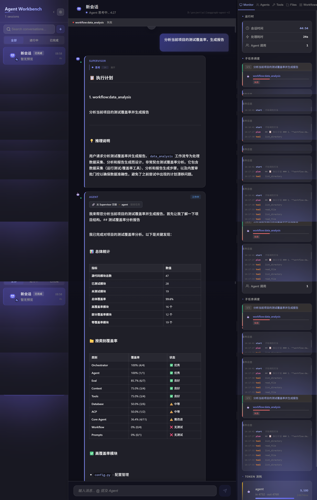
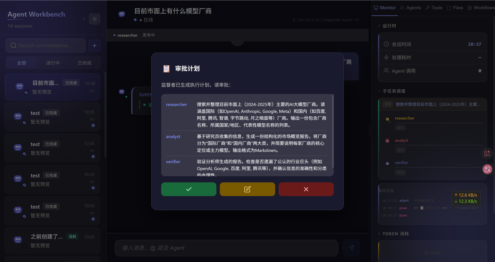

# LangGraph Agent v2 — 多智能体编排与评估引擎

基于 LangChain + LangGraph + FastAPI 的多智能体协作系统，支持 **两阶段编排**（单代理 ReAct / 多代理 StateGraph）、**ACP 协议集成** 外部编码代理、**JSON 定义工作流引擎** 以及 **离线回归评估系统**。179 测试覆盖，实时 SSE 流式传输，生产就绪。

---

## 界面预览

### 多代理编排 — DAG 工作流执行



拓扑栏展示 `workflow:data_analysis` 由 `Supervisor` → `agent` → `approval` 三个阶段流转，底部事件日志记录 29 次工具调用时间线（`list_directory`、`read_file`、`execute_code`、`search_files`、`write_file`）。右侧 Monitor 面板显示 token 消耗 9,500（$0.0285）、阶段耗时、子任务状态。

### 审批门控 — HITL 人工审核



工作流执行到 `approval` 节点时触发 HITL 中断，前端展示审批对话框。用户可确认数据分析结果是否正确，或驳回重新执行。审批决策通过 `POST /api/orchestrate/{session_id}/review` 提交，恢复被中断的 StateGraph。

### 多代理查询 + Eval 评估


左侧 Supervisor 通过 StateGraph 调度 `researcher` 代理完成"目前项目用什么模型启动"查询。侧边栏每个 session 提供 ▶ 按钮，一键从历史会话构建 eval case；Eval tab 展示 PASS/FAIL 状态 + 失败详情 + 30 天趋势 + 5 维优化建议。

---

## 核心亮点

### 🧠 两阶段编排架构

系统提供两种互补的执行路径：

| 路径 | 入口 | 适用场景 |
|------|------|----------|
| **Agent**（单代理 ReAct） | `/chat` | 简单问答、单一工具链 |
| **Orchestrator**（多代理 StateGraph） | `/api/orchestrate` | 复杂任务分解、多代理协作 |

Orchestrator 采用 LangGraph **StateGraph** 5 节点流程：

```
plan → wait → dispatch → synthesize → reflect
```

- **plan**: LLM 自主生成结构化 JSON 计划（步骤 + 依赖关系 + 推理说明），支持 3 个内置工作流模板注入
- **wait**: HITL（Human-in-the-Loop）中断审核 — 用户可在前端审查、修改或拒绝计划
- **dispatch**: 按 DAG 依赖图执行子代理，上游结果通过 `depends_on` 索引自动注入下游 Context
- **synthesize**: Review 节点审计，输出审计报告（含所有 agent 原始产物 + `agent_outputs`）
- **reflect**: 反模式检测，记录经验到 `memory/experiences.md`

**子代理矩阵**（配置在 `config/agents.json`）：

| 代理 | 类型 | 工具 | 用途 |
|------|------|------|------|
| coder | 本地 | execute_code, read_file, write_file, search_files, load_skill | 代码生成、调试、重构 |
| researcher | 本地 | search_files, list_directory, read_file | 信息检索与文件搜索 |
| analyst | 本地 | execute_code, read_file, search_files | 数据分析与报告 |
| verifier | 本地 | read_file, search_files, list_directory, execute_code | 事实核查与引用验证 |
| direct | 本地 | 全部 5 个工具 | 直接助手，处理简单任务 |
| opencode | ACP | — | 外部 AI 编码代理（OpenCode ACP） |
| claude | ACP | — | 外部 AI 编码代理（Claude Code ACP） |

### 🔌 ACP 协议集成

通过 Agent Client Protocol（JSON-RPC 2.0 over stdio）将外部编码代理无缝接入。前端通过 `@opencode` 或 `@claude` 直接调用，Supervisor 也可在计划中调度 ACP 代理。

- 全会话生命周期管理（创建、流式、完成、错误）
- SSE 流式传输 + 服务端 batching（200 char thinking / 150 char message 阈值）
- Windows `.ps1` 脚本自动检测（`Get-Command`）
- ACP 事件 → 标准 SSE 事件映射（`tool_call`、`thinking`、`message`、`metrics`）

### ⚡ 动态工作流引擎

`DynamicGraphEngine` 提供 JSON 可配置的 DAG 图执行系统：

```json
{
  "nodes": [
    {"id": "collect", "type": "agent", "agent_id": "researcher", "task": "数据采集"},
    {"id": "analyze", "type": "agent", "agent_id": "analyst", "task": "分析数据"},
    {"id": "review",  "type": "approval", "message": "确认结果"},
    {"id": "report",  "type": "finish"}
  ],
  "edges": [
    {"from": "collect", "to": "analyze"},
    {"from": "analyze", "to": "review"},
    {"from": "review",  "to": "report"}
  ]
}
```

- 3 种节点类型：**agent**（调用子代理）、**approval**（审批门控）、**finish**（结束）
- 自动上下文传递 + 状态持久化（SQLite checkpoint）
- 支持子图嵌套（`subgraph_factory.py` 构建孙图）
- 触发方式：`/workflow` 聊天命令或 `POST /api/workflows/*`
- 内置 3 个工作流模板（`config/workflows.json`）

### 🎯 离线回归评估系统

自包含的离线评估框架，零外部依赖：

**工作流：** 历史会话 → case 构建 → 断言运行 → 5 维分析 → 配置优化

#### Case 构建
`case_builder.py` 从真实对话反向推断 eval case：
- 提取首条人类消息作为 task
- 解析 `tool_calls` JSON 提取工具名（自动过滤 ACP 文件路径噪声）
- 中文字符占比 > 5% 自动标记 `language: chinese`
- 统计 AI 输出总长度作为 `min_output_length` 下界
- 侧边栏 ▶ 按钮一键构建，`INSERT OR REPLACE` 确保每个 session 唯一 case

#### 断言系统
8 种事件驱动的检查器，全部在 SSE 事件流上操作，与编排器实现解耦：

| 断言 | 检查内容 |
|------|----------|
| `check_tool_called` | 必须调用的工具 |
| `check_tool_not_called` | 禁止调用的工具 |
| `check_language` | 输出语言 |
| `check_output_length` | 输出长度范围 |
| `check_content_contains` | 必须包含的关键词 |
| `check_content_not_contain` | 禁止出现的内容 |
| `check_plan_steps` | 计划步骤数 |
| `check_plan_agents` | 计划中出现的代理 |

#### 5 维分析引擎（`analyzer.py`）

纯启发式规则引擎，无 LLM 依赖：

| 维度 | 指标 | 阈值 | 建议 |
|------|------|------|------|
| **prompt** | verifier/hallucination 失败率 | > 15% + ≥ 3 样本 | 追加防幻觉保护从句 |
| **agent** | 单代理失败次数 | ≥ 3 | 降低 temperature (0.7 → 0.3) |
| **agent** | 平均输出 token | > 2000 | 设置 max_tokens = avg × 1.2 |
| **workflow** | 代理组合重复次数 | ≥ 3 | 建议注册为预定义 workflow |
| **context** | 单会话最大消息数 | > 20 | 降低压缩阈值 (0.7 → 0.5) |
| **skill** | 工具调用次数 | = 0 | 建议禁用未使用的工具 |

- 置信度公式随样本量渐近，小样本时自动降权
- 去重机制：已存在的 active suggestion 跳过，防止建议膨胀
- Suggestion 有完整生命周期：`applied` / `dismissed` 状态管理

### 📡 SSE 实时流式架构

基于 Server-Sent Events 的全链路实时通信：

- 服务端 `_passthrough` batching（200 char thinking / 150 char message 阈值）
- 前端背压队列（MICRO/STEP/MACRO 三级）+ typewriter RAF 调度
- 120ms STEP_DELAY 延迟调度 tool_call / message / plan / summary 事件
- 14 种结构化事件类型（`thinking` → `tool_call` → `message` → `plan` → `audit_summary` → `done`）
- 审计摘要附带所有 agent 原始输出（`agent_outputs` 字段）

### 🗜️ 智能上下文压缩

当 token 用量超过阈值（默认 70%）时自动触发：保留最近 `keep` 轮对话，通过 LLM 将历史压缩为结构化摘要。支持 `/compact` 手动触发。

### 💾 双重记忆系统

- **SQLite**: 结构化元数据存储（会话、消息、工具使用记录、审计摘要 + 评估数据）
- **ChromaDB**: 向量相似度搜索

### ⚡ 动态配置热加载

所有代理、工具、技能、ACP 配置均存储在 `config/*.json` 中，`ConfigManager` 每 5 秒轮询变更并自动重载（`agents.json`、`tools.json`、`skills.json`、`acp_agents.json`、`workflows.json`）。

### 🚦 错误弹性

- 子代理输出截断自动重试（`tools.py:_is_truncated`）
- 熔断器（circuit breaker）防止连续失败雪崩
- 结构化错误信封统一错误处理

---

## Eval 设计思想

### 设计哲学

**离线优先** — 所有评估数据存储在本地的同一 SQLite 数据库中（`memory/sessions.db`），与业务数据同源。无需外部评估服务，无需 LangSmith 依赖。每次 run 是纯粹的离线回归检查。

**自增语料** — `case_builder.py` 从真实用户会话反向推断 eval case。这意味着评估用例库会随着生产使用自然增长，无需手动编写测试用例。推断是**保守**的：它记录"实际发生了什么"而非"应该发生什么"，所以它捕获的是**回归信号**——如果未来代理行为发生变化，case 就会失败。

**事件驱动断言** — 所有断言操作在原始的 SSE 事件流（`list[dict]`）上进行，而非在编排器的内部状态上。每个检查函数有统一签名 `(events, *args) -> EvalResultItem`，通过 `run_assertions` 根据 `EvalExpectation` 的非空字段自动调度。这使断言层与编排器实现完全解耦。

**Spec-as-Data** — `EvalExpectation` 是可序列化的 Pydantic 模型，是整个评估系统的声明式规范。它可以从历史推断、手动编写、或程序化修改。相同的 spec 对象用于 case 构建和断言运行。

**快照可复现** — 每个 `EvalRun` 保存完整的 `metrics_snapshot` 和 `config_snapshot`，记录"在这个配置下，这些是指标"。即使配置随时间演化，也能进行历史回归分析。`session_id` 和 `thread_id` 字段允许追溯到具体的编排器会话和 LangGraph checkpoint。

**闭环分析** — 5 维分析引擎将积累的 run 数据转化为可操作的配置建议。每个建议有明确的修改目标、置信度评分、和应用/驳回生命周期。分析器是纯启发式的（无 LLM 调用），保证低成本和可预测性。

### 数据流

```
历史会话 (sessions + messages)
     │
     ▼
case_builder.py  ──→  eval_cases  ──→  runner.py  ──→  eval_runs
     │                                      │
     │                            run_assertions(events, expected)
     │                                      │
     └──────────────────────────────────────┤
                                           ▼
                                    analyzer.py  ──→  suggestions  ──→  config/*.json
```

---

## 当前局限

### 1. 无 Checkpoint + Timeline 集成
Eval run 虽然记录了 `session_id` 和 `thread_id`，但无法在断言失败时**自动跳转到对应的 orchestrator checkpoint** 并回放断点时间线。用户需要手动去数据库查找。缺少"断言失败 → 加载 checkpoint → 回放 LLM 调用 → 可视化断点"的闭环体验。

### 2. 无自优化闭环
Analyzer 生成的 `suggestions` 是纯信息性的——用户需要手动编辑 `config/*.json` 来应用建议。缺少自动 apply 机制（生成 diff → 确认 → 合并 → 重启）。也没有在 apply 后自动对比优化前后的 pass rate。

### 3. Mock 模式仅测试编排路径
`mock_model=True` 模式下，runner 只 mock 了 LLM 调用（返回预定义的 JSON plan），测试的是编排器的 DAG 调度逻辑，而非实际模型的推理能力。无法捕获模型回归、幻觉、或输出质量退化。

### 4. 无并发控制
`run_cases` 的 `max_concurrent` 参数已声明但未实现（当前为线性执行）。这是有意设计以避免 SQLite 写冲突，但在大规模场景（50+ cases）下评估耗时较长。

### 5. Case 推断过于保守
`_infer_expectation` 只记录"实际发生了什么"，不推断"应该发生什么"。例如，如果历史会话中没有调用某个预期工具，case 不会要求它。这导致 case 只能捕获**行为变化**，无法捕获**行为缺失**。

### 6. 语言检测仅支持中文
`re.findall(r"[\u4e00-\u9fff]")` 只覆盖中文字符，不覆盖日文（平假名/片假名）、韩文（谚文）、阿拉伯文等。多语言场景下语言断言可能失效或产生误报。

### 7. 无持续集成集成
所有评估是手动触发的（通过 `/eval` 命令或 Eval UI），尚未接入 CI/CD pipeline。无法在每次部署前自动运行评估套件。

---

## 后续计划

### Phase 1: Checkpoint + Timeline

- 将 `EvalRun` 的 `thread_id` 与 LangGraph checkpoint store 关联
- 断言失败时自动加载对应 checkpoint，提取 LLM 调用序列和状态变更
- 新增 `TimelineView`：时间线可视化，展示从 task 输入到每个 LLM 调用到最终输出的完整链路
- 在失败详情中提供"跳转到断点"按钮，直接打开 orchestrator 的 checkpoint 状态
- 后端新增 `GET /api/eval/runs/{task_id}/timeline` 端点

### Phase 2: Eval 自优化闭环

- Analyzer 输出建议时同时生成配置 diff（`config.patch.json`）
- 用户确认后自动写入对应 `config/*.json`（覆盖或合并）
- Apply 后自动触发一轮 eval run，对比优化前后的 pass rate
- 新增 `EvalOptimizationRecord`：记录每次优化迭代的配置变化和效果
- 最终目标：**analyze → suggest → apply → verify** 全自动闭环

### Phase 3: 大规模 & 混合模式

- 实现信号量并发控制（`max_concurrent`），可选开启
- 混合评估模式：先用 mock 快速跑全量 case（测试编排路径），再 real 跑关键 case（测试模型输出）
- 支持 case 优先级标签（`P0` / `P1` / `P2`），按优先级决定 real 执行顺序
- 多语言检测扩展：增加日文（`[\u3040-\u309f\u30a0-\u30ff]`）、韩文（`[\uac00-\ud7af]`）支持
- CI/CD 集成：`pytest tests/test_eval.py` 加入 pre-commit hook / GitHub Actions

---

## 快速开始

### 后端

```bash
cp .env.example .env
# 编辑 .env 填入 API Key

pip install -e ".[dev]"
python server.py
# → http://localhost:8000
```

### 前端

```bash
cd ui
npm install
npm run dev
# → http://localhost:3000 (代理 API 到 :8000)
```

### CLI

```bash
# 单条消息
python -m src.agent.main --input "What is 2+2?"

# 交互模式
python -m src.agent.main --interactive
```

---

## 配置

### 环境变量 (`.env`)

```bash
# 模型配置
AGENT_MODEL_PROVIDER=openai       # openai | anthropic
AGENT_MODEL_NAME=gpt-4o

# API Key
OPENAI_API_KEY=sk-xxx
OPENAI_BASE_URL=https://api.openai.com/v1
ANTHROPIC_API_KEY=sk-ant-xxx

# 上下文
AGENT_MAX_TOKENS=128000
AGENT_COMPRESSION_THRESHOLD=0.7
AGENT_ENABLE_THINKING=true        # DashScope/GLM/DeepSeek 设为 false

# 存储
AGENT_MEMORY_DB_PATH=memory/agent.db
AGENT_CHROMA_PATH=memory/chroma

# 服务端
AGENT_SERVER_HOST=0.0.0.0
AGENT_SERVER_PORT=8000
```

支持任何 OpenAI 兼容 API（DeepSeek、DashScope、GLM 等），通过 `OPENAI_BASE_URL` 配置。

### JSON 配置文件（5 秒热加载）

| 文件 | 用途 |
|------|------|
| `config/agents.json` | 代理定义（模型、工具、系统提示词、温度、ACP 模式） |
| `config/tools.json` | 工具模块路径和元数据 |
| `config/skills.json` | 技能到代理的映射 |
| `config/acp_agents.json` | 外部 CLI 代理配置（命令、参数、超时、工作目录） |
| `config/workflows.json` | 预定义工作流 DAG 定义 |

---

## 技术架构

```
┌──────────────────────────────────────────────────────────┐
│  Vue 3 + Pinia Frontend (port 3000)                      │
│  messageManager + streamManager composables              │
│  Chat · Agents · Files · Workflows · Eval · Monitor      │
└─────────────────────┬────────────────────────────────────┘
                      │ HTTP / SSE
┌─────────────────────▼────────────────────────────────────┐
│  FastAPI Server (port 8000)                               │
│  /chat  /api/orchestrate  /api/acp/send  /api/eval/*      │
├──────────────────────────────────────────────────────────┤
│                                                          │
│  Agent (单代理)      Orchestrator (多代理 StateGraph)      │
│  ReAct 循环          5 节点: plan→wait→                   │
│  astream_events     dispatch→synthesize→reflect           │
│                                                          │
│  ACP Agent (外部 CLI)    Workflow Engine (JSON DAG)       │
│  JSON-RPC 2.0 over stdio  DynamicGraphEngine              │
│                                                          │
├──────────────────────────────────────────────────────────┤
│  Eval: case_builder → runner → assertions → analyzer      │
│  Context: Compression · Memory (SQLite + ChromaDB)        │
│  ConfigManager (5s hot-reload) · Skills injection         │
│  Error handler (circuit breaker + retry)                 │
├──────────────────────────────────────────────────────────┤
│  SQLite (sessions / messages / eval_cases / eval_runs)    │
│  ChromaDB (vector similarity search)                     │
└──────────────────────────────────────────────────────────┘
```

### 后端包结构

```
src/agent/
├── events.py                    # EventType + make_event 工厂
├── message.py                   # Message dataclass
├── config.py                    # AgentConfig (.env)
├── config_manager.py            # 热加载 JSON 配置（5s 轮询）
├── models.py                    # resolve_model()
├── agent/                       # 单代理 ReAct 循环
│   └── core.py
├── db/                          # 持久化层
│   ├── connection.py            # SQLite + auto-migration
│   ├── sessions.py              # 会话 CRUD + audit_summary
│   ├── messages.py              # 消息 CRUD
│   ├── tasks.py                 # 任务更新（去重）
│   ├── tools.py                 # save_metrics / load_metrics
│   └── compact.py               # 会话压缩
├── orchestrator/                # 多代理编排（StateGraph）
│   ├── core.py                  # 5 节点 StateGraph
│   ├── planner.py               # Pydantic 模型 + 计划辅助
│   ├── tools.py                 # SubAgentTool + ACPSubAgentTool
│   └── _events.py               # 事件重导出
├── workflow/                    # 动态工作流引擎
│   ├── subgraph_factory.py      # LangGraph 子图构建
│   ├── context_manager.py       # 工作流上下文传递
│   ├── command_dispatcher.py    # /workflow 命令路由
│   ├── graph_config_manager.py  # JSON 图配置管理
│   └── checkpoint_manager.py    # 工作流状态持久化
├── eval/                        # 离线回归评估系统
│   ├── models.py                # EvalCase / EvalRun / EvalExpectation
│   ├── storage.py               # SQLite CRUD（3 表）
│   ├── case_builder.py          # 从历史会话构建 case
│   ├── runner.py                # 执行引擎（mock/real）
│   ├── assertions.py            # 8 种事件驱动检查器
│   ├── analyzer.py              # 5 维分析引擎
│   └── cli.py                   # /eval 命令接口
├── acp_agent.py                 # ACP 代理包装
├── acp/                         # ACP 原生客户端
│   └── client.py                # ACPNativeClient（JSON-RPC 2.0）
├── context/                     # 上下文管理
│   ├── compression.py           # ContextCompressor
│   ├── memory.py                # SQLite + ChromaDB 双写
│   ├── _helpers.py
│   └── tool_result_manager.py
├── tools/                       # 5 个内置工具
│   ├── execute_code.py          # Python 沙箱执行
│   ├── file_ops.py              # 读写文件 + 列表目录
│   ├── search.py                # glob 搜索
│   └── load_skill.py            # 技能加载
├── error_handler.py             # 错误重试 + 熔断
├── file_service.py              # 文件浏览服务
├── skills.py                    # 技能管理器
├── audit_logger.py              # 审计日志
└── prompts/                     # 系统提示词
    └── system_prompt.py         # SUPERVISOR_PLAN_PROMPT_V2 etc
```

---

## SSE 事件类型

| 事件 | 来源 | 说明 |
|------|------|------|
| `thinking_start` | Agent/Orchestrator | LLM 推理开始 |
| `thinking` | Agent/Orchestrator | 推理内容增量 |
| `thinking_done` | Agent/Orchestrator | 推理完成 |
| `tool_call` | Agent/Orchestrator | 工具调用 |
| `message` | Agent/Orchestrator | 最终响应 |
| `plan` | Orchestrator | 执行计划（含 steps 数组） |
| `task_update` | Orchestrator | 子代理任务状态（pending/running/completed/failed）|
| `summary` | Orchestrator | 多代理结果汇总 |
| `audit_summary` | Orchestrator | 审计报告 + `agent_outputs`（所有 agent 原始输出）|
| `metrics` | Any | Token 消耗和耗时 |
| `interrupt` | Orchestrator | HITL 中断（含 thread_id + plan） |
| `permission_request` | Orchestrator | 工具调用权限请求 |
| `error` | Any | 错误事件 |
| `done` | Any | 流完成 |

---

## 开发

```bash
# 后端
pip install -e ".[dev]"
pytest --cov=src -v              # 179 测试 + 覆盖率
pytest -k "test_name"            # 单个测试
ruff check .                     # Lint
ruff check --fix .               # 自动修复
mypy src                         # 类型检查（告警仅供参考）

# 前端
cd ui
npm run dev                      # Vite 开发服务器 (port 3000)
npx vue-tsc -b && npx vite build # 生产构建
```

### 测试说明
- `tests/conftest.py` 自动隔离环境变量（mock key、临时 DB 路径）— 无需真实 API Key
- Orchestrator 测试 mock `resolve_model` 通过 `from src.agent import models as _models` 模式
- Mock 模型返回预定义 JSON 计划，不调用真实 LLM
- Eval 测试 mock `Orchestrator.run` 返回合成事件流，覆盖成功/失败/异常路径

---

## API 接口

### 聊天与流式

| 方法 | 路径 | 说明 |
|------|------|------|
| `POST` | `/chat` | SSE 流，单代理 |
| `GET` | `/chat/stream` | SSE 流，单代理（GET 方式，适用 EventSource） |
| `POST` | `/api/orchestrate` | SSE 流，多代理编排 |
| `POST` | `/api/orchestrate/{session_id}/review` | 提交 HITL 审核决策 |

### 工作流

| 方法 | 路径 | 说明 |
|------|------|------|
| `GET` | `/api/workflows` | 列出工作流 |
| `POST` | `/api/workflows` | 创建/更新工作流 |
| `GET` | `/api/workflows/{id}` | 获取工作流详情 |
| `DELETE` | `/api/workflows/{id}` | 删除工作流 |
| `POST` | `/api/workflows/{id}/approve` | 审批门控确认 |

### 会话

| 方法 | 路径 | 说明 |
|------|------|------|
| `GET` | `/api/sessions` | 列出会话 |
| `POST` | `/api/sessions` | 新建会话 |
| `GET` | `/api/sessions/{id}` | 获取会话及消息 |
| `PATCH` | `/api/sessions/{id}/title` | 重命名 |
| `DELETE` | `/api/sessions/{id}` | 删除 |
| `POST` | `/api/compact` | 压缩上下文 |

### 评估 (Eval)

| 方法 | 路径 | 说明 |
|------|------|------|
| `GET` | `/api/eval/cases` | 列出评估用例 |
| `GET` | `/api/eval/cases/{id}` | 获取单个用例 + 最新 run |
| `POST` | `/api/eval/cases/build` | 从历史会话构建用例 |
| `POST` | `/api/eval/cases/build-from-session/{id}` | 从指定会话构建用例 |
| `POST` | `/api/eval/cases/{id}/run` | 运行单个用例 |
| `POST` | `/api/eval/run-all` | 运行全部用例 |
| `GET` | `/api/eval/runs` | 列出运行记录 |
| `GET` | `/api/eval/trend/{id}` | 30 天通过率趋势 |
| `GET` | `/api/eval/suggestions` | 列出优化建议 |
| `POST` | `/api/eval/analyze` | 触发 5 维分析 |

### ACP 代理

| 方法 | 路径 | 说明 |
|------|------|------|
| `GET` | `/api/acp/agents` | 列出 ACP 代理 |
| `POST` | `/api/acp/send` | 发送消息（SSE 流） |
| `GET` | `/api/acp/check/{id}` | 可用性检查 |

### 记忆与文件

| 方法 | 路径 | 说明 |
|------|------|------|
| `POST` | `/api/memory/store` | 记忆存储 |
| `POST` | `/api/memory/query` | 向量查询 |
| `GET` | `/api/files/tree` | 文件树 |
| `GET` | `/api/files/content` | 文件内容 |

---

## 技术栈

| 层级 | 技术 |
|------|------|
| LLM 框架 | LangChain + LangGraph |
| 代理引擎 | `create_react_agent` (ReAct) |
| 编排器 | LangGraph StateGraph（5 节点） |
| 工作流引擎 | DynamicGraphEngine（JSON DAG） |
| 评估系统 | case_builder + runner + assertions + analyzer |
| ACP 协议 | JSON-RPC 2.0 over stdio |
| 服务端 | FastAPI + sse-starlette + uvicorn |
| 前端 | Vue 3 + Pinia + Vite + TypeScript |
| Markdown | marked + highlight.js + KaTeX |
| 存储 | SQLite + ChromaDB |
| 配置 | Pydantic Settings (.env) + JSON 热加载 |
| 测试 | pytest + coverage（179 测试） |

---

## 注意事项

- `python server.py --reload` 在 Windows 上可能失败（uvicorn 热重载兼容问题）
- `tests/conftest.py` 自动隔离环境变量 — 测试无需真实 API Key
- 导入 `resolve_model` 必须用 `from src.agent import models as _models; _models.resolve_model()`（否则 mock 失效）
- 前端 message `toolCalls` 类型定义在 `api/types.ts`；所有消息操作走 `messageManager`，禁止本地引用 alias
- ACP agents 需要在 `config/acp_agents.json` 中注册 CLI 路径，并在 `config/agents.json` 设置 `acp_mode: true`
- 更多开发细节见 `AGENTS.md`
